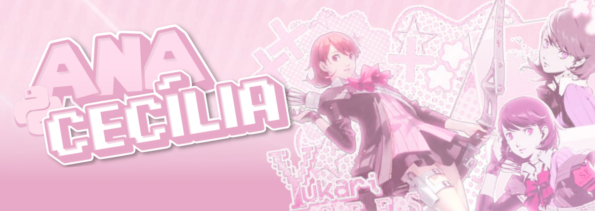

  

  

  
  <h1>print(f"Hello World!") I am Ana Cecília °˖➴</h1>
  <strong>Full-Stack Developer | Python, PHP, TypeScript, React.js and Next.js | Web and Data-driven development</strong> 
    <em>Focused on building scalable, responsive, and secure applications. I combine sustainable coding practices with robust data management and high-standard security systems.</em>

 

**Front-end stacks:**  
 
 
 
 

 

**Back-end stacks and tools:**  
 
 
 

  

  
  &nbsp;&nbsp;
  

  
  

